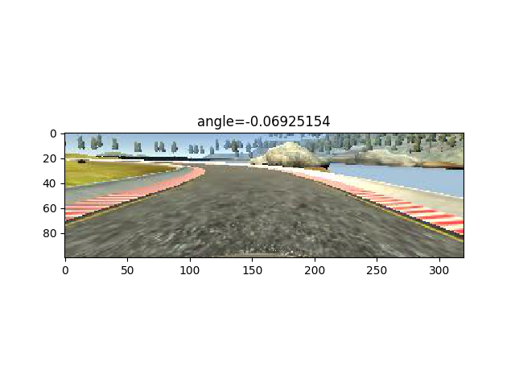
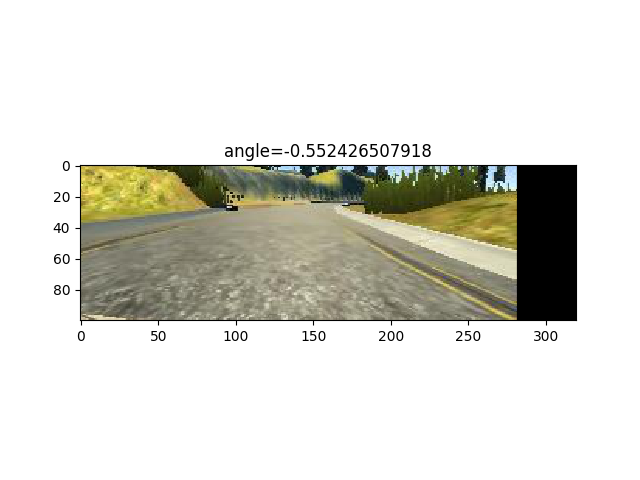
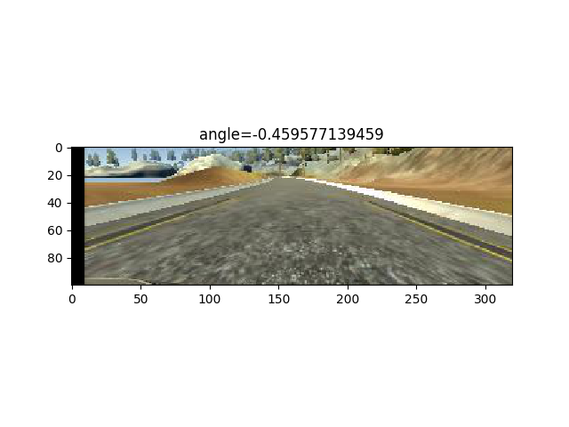
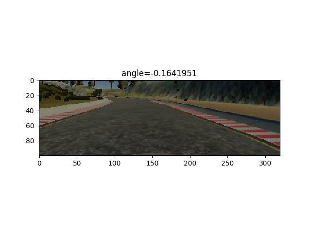
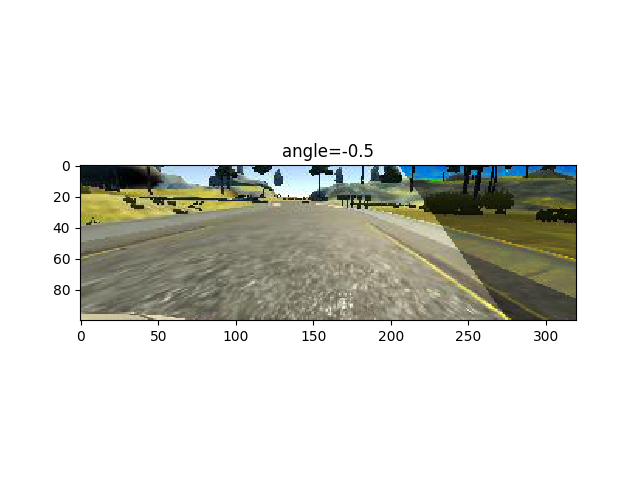
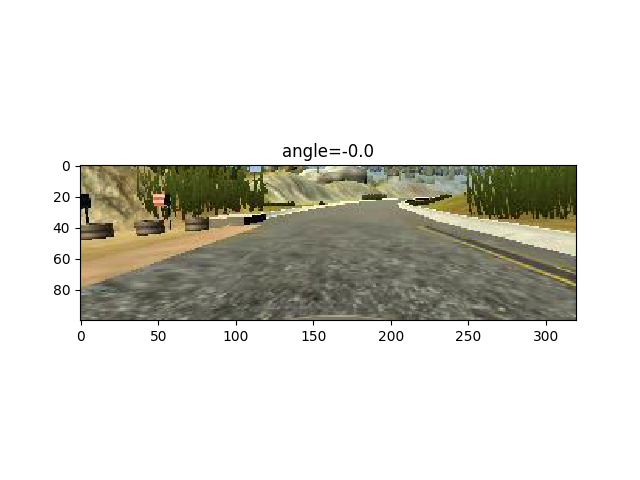

# Behavioral Cloning

## Required Files
### Are all required files submitted?
The submission includes a model.py file, drive.py, model.h5, a writeup report and a running video.
* model.py containing the script to create and train the model
* drive.py for driving the car in autonomous mode
* model.h5 containing a trained convolution neural network 
* writeup.ipynb
* run1.mp4, a test1 with speed of 30mph.

## Quality of Code
### Is the code functional?
The model provided can be used to successfully operate the simulation.
I have modified the drive.py in order to chop the image from the simulator. 
I cut 40pixel at top and 20pixel at bottom.

### Is the code usable and readable?
The code is ver short and therefore easy to read, Despite of that I have added comments and references.


## Model Architecture and Training Strategy
### Has an appropriate model architecture been employed for the task?
I have tryied a variety of models but eventually I have use the NVidia architectura but with an input of 100x320 since I have chop the image 40pixel top and 20pixel bottom. 

I don't use the last convolutional layer 64@1x18.

The reference to the paper is:

http://images.nvidia.com/content/tegra/automotive/images/2016/solutions/pdf/end-to-end-dl-using-px.pdf

Here is the code definning the model:


```python
model = Sequential()
# Preprocess incoming data, centered around zero with small standard deviation 
# From NVIDIA paper: http://images.nvidia.com/content/tegra/automotive/images/2016/solutions/pdf/end-to-end-dl-using-px.pdf
# In my case the input image is 120x320 not 66x220
model.add(Lambda(lambda x: x/127.5 - 1.,
        input_shape=( row, col,ch),
        output_shape=(row, col, ch)))
model.add(Conv2D(24, 5, 5, input_shape=(row, col, ch)))
model.add(MaxPooling2D((2,2)))
model.add((Dropout(0.5)))
model.add(Conv2D(36, 5, 5))
model.add(MaxPooling2D((2,2)))
model.add((Dropout(0.5)))
model.add(Conv2D(48, 3, 3))
model.add(MaxPooling2D((2,2)))
model.add((Dropout(0.5)))
model.add(Conv2D(64, 3, 3))
model.add(MaxPooling2D((2,2)))
model.add((Dropout(0.5)))
model.add(Flatten())
model.add(Dense(100, activation='relu'))
model.add(Dense(50, activation='relu'))
model.add(Dense(10, activation='relu'))
model.add(Dense(1, activation='linear'))

```

### Has an attempt been made to reduce overfitting of the model?
I use dropout after each convolutional layer.
I use data augmentation in order to reduce overfitting, after reading this two blogs:

* https://chatbotslife.com/using-augmentation-to-mimic-human-driving-496b569760a9#.zc82yp45t
* https://blog.keras.io/building-powerful-image-classification-models-using-very-little-data.html

I use brightness, affine transform, only on X axis, flipped image and shadow augmentation.

Here you can see the code, from Vivek Yadav:


```python
# From: https://chatbotslife.com/using-augmentation-to-mimic-human-driving-496b569760a9#.o92uic4yq
# Data aumentation with brightness, shadow and transformations
def augment_brightness_camera_images(image):
    image1 = cv2.cvtColor(image,cv2.COLOR_RGB2HSV)
    random_bright = .25+np.random.uniform()
    #print(random_bright)
    image1[:,:,2] = image1[:,:,2]*random_bright
    image1 = cv2.cvtColor(image1,cv2.COLOR_HSV2RGB)
    return image1
def trans_image(image,steer,trans_range):
    # Translation
    cols=image.shape[1]
    rows=image.shape[0]
    tr_x = trans_range*np.random.uniform()-trans_range/2
    steer_ang = steer + tr_x/trans_range*2*.2
    tr_y = 40*np.random.uniform()-40/2
    tr_y = 0
    Trans_M = np.float32([[1,0,tr_x],[0,1,tr_y]])
    image_tr = cv2.warpAffine(image,Trans_M,(cols,rows))
    return image_tr,steer_ang
def add_random_shadow(image):
    top_y = 320*np.random.uniform()
    top_x = 0
    bot_x = 160
    bot_y = 320*np.random.uniform()
    image_hls = cv2.cvtColor(image,cv2.COLOR_RGB2HLS)
    shadow_mask = 0*image_hls[:,:,1]
    X_m = np.mgrid[0:image.shape[0],0:image.shape[1]][0]
    Y_m = np.mgrid[0:image.shape[0],0:image.shape[1]][1]
    shadow_mask[((X_m-top_x)*(bot_y-top_y) -(bot_x - top_x)*(Y_m-top_y) >=0)]=1
    #random_bright = .25+.7*np.random.uniform()
    if np.random.randint(2)==1:
        random_bright = .5
        cond1 = shadow_mask==1
        cond0 = shadow_mask==0
        if np.random.randint(2)==1:
            image_hls[:,:,1][cond1] = image_hls[:,:,1][cond1]*random_bright
        else:
            image_hls[:,:,1][cond0] = image_hls[:,:,1][cond0]*random_bright    
    image = cv2.cvtColor(image_hls,cv2.COLOR_HLS2RGB)
    return image

```

### Have the model parameters been tuned appropriately?
Learning rate parameters are chosen with explanation, or an Adam optimizer is used.

Here is the code where I use the optimizer, loss and metrics:


```python
model.compile(loss='mean_squared_error',
              optimizer='adam',
              metrics=['accuracy'])
```

### Is the training data chosen appropriately?
I have use the data from the course. In order to get robustness and reduce overffiting.
I borrow a usb steering wheel in order to get data, but eventualy it has not been necessary since I have been able to keep the car on the track, even though trainning just with left, center and right images is more difficult.

## Architecture and Training Documentation
### Is the solution design documented?

Firstly I started with a model from P2 sign recognition, made some modifications, added layers, but given that Nvidia did a good work and I was not as confident as I am now, I eventualy chose the Nvidia model but addapted to my image chopping.

### Is the model architecture documented?
I have used the Nvidia network with some differences.

His is the original Nvidia model:


There are two main differences on my model, the code of the model is above:
* I use an input of 100x320 since I have chop the image 40pixel top and 20pixel bottom.
* I don't use the last convolutional layer 64@1x18.

Information of keras with the total numbers of parameters is:


### Is the creation of the training dataset and training process documented?
The trainning data set has been generated on the fly by data aumentation.

Here it can seen the generator code:


```python
def generator(samples, batch_size=32):
    num_samples = len(samples)
    while 1: # Used as a reference pointer so code always loops back around
        sklearn.utils.shuffle(samples)
        for offset in range(0, num_samples, batch_size):
            batch_samples = samples[offset:offset+batch_size]
            images = []
            angles = []
            for batch_sample in batch_samples:
                side = np.random.randint(3)
                if side==0:
	            #center
                    name = './data/IMG/'+batch_sample[0].split('/')[-1]
                    center_image = cv2.imread(name)
                    center_angle = float(batch_sample[3])
                    image=center_image
                    angle=center_angle
                if side==1:
                    #left
                    name = './data/IMG/'+batch_sample[1].split('/')[-1]
                    left_image = cv2.imread(name)
                    left_angle = float(batch_sample[3])+0.5
                    image=left_image
                    angle=left_angle
                if side==2:
                    #right
                    name = './data/IMG/'+batch_sample[2].split('/')[-1]
                    right_image = cv2.imread(name)
                    right_angle = float(batch_sample[3])-0.5
                    image=right_image
                    angle=right_angle
                image=cv2.cvtColor(image,cv2.COLOR_BGR2RGB)
                flip=np.random.randint(5)
                if flip==1:
                    image = np.fliplr(image)
                    angle = -angle
                if flip==2:
                    image,angle=trans_image(image,angle,100)
                if flip==3:
                    image = augment_brightness_camera_images(image)
                if flip==4:
                    image = add_random_shadow(image)
                images.append(image)
                angles.append(angle)
            # trim image to only see section with road
            X_train = np.array(images,np.float32)
            X_train = X_train[:,40:-20,:,:] 
            y_train = np.array(angles)
            yield sklearn.utils.shuffle(X_train, y_train)
```

The code above augment the data in a number os ways.
I show a image for every type of data augmentation:
* flip: flip the image in order to balance movement.

* shift_left: shift image to the left in order to do a kind of recovery data

* shift_right: shift image to the right in order to do a kind of recovery data

* brightness: change brightness in order to make it brightness data invariant

* shadow: add shadow to image in order to make it shadow data invariant

* usual: just usual image from the dataset


This data augmentation has been paramount in order to make the neuralnetwork work properly. 

In order to get the best model I have done a kind of earlystoping, since I have used a callback in the fitting proccess in order to choose the best model generated. I have deffined a ModelCheckpoint that saves the best model up to the actual epoch.

The best model is:

model-checkpoint-63-0.16.hdf5

A model with accuracy 0.16 at epoch 63, I ran the model for 100 epochs.

Here is the code:


```python
filepath="model-checkpoint-{epoch:02d}-{val_acc:.2f}.hdf5"
checkpoint = ModelCheckpoint(filepath, monitor='val_acc', verbose=1, save_best_only=True, mode='max')
callbacks_list = [checkpoint]
model.fit_generator(train_generator, 
                    samples_per_epoch= len(train_samples)*3, 
                    validation_data=validation_generator, 
                    nb_val_samples=len(validation_samples),
                    callbacks=callbacks_list, 
                    nb_epoch=100)
```

## Simulation
### Is the car able to navigate correctly on test data?
The model is able to drive all the test1 track in full speed 30mph, with no issues.

I uploaded a video where it can be seen how well the model perform.


## Suggestions to Make Your Project Stand Out!
### Track Two
Since I am running out of time I have not been able to generalize more the model in order to work on test2 track.

I am planning to make a autonomous RC car with real data, in a short time.

But for the moment I am going to finish P5.


```python

```
