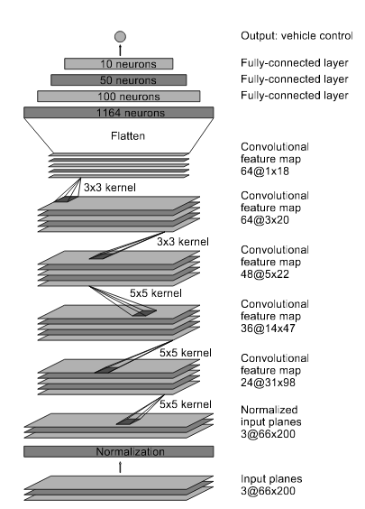
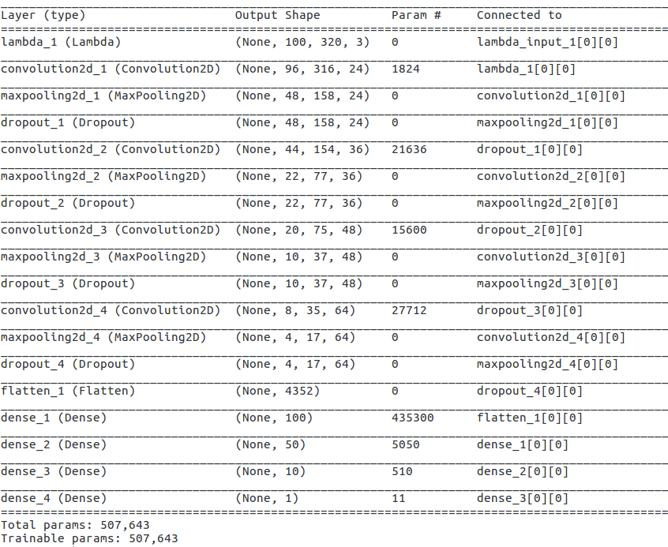

# Behavioral Cloning

## Required Files
### Are all required files submitted?
The submission includes a model.py file, drive.py, model.h5, a writeup report and a running video.
* model.py containing the script to create and train the model
* drive.py for driving the car in autonomous mode
* model.h5 containing a trained convolution neural network 
* writeup.ipynb
* run1.mp4, a test1 with speed of 30mph.

## Quality of Code
### Is the code functional?
The model provided can be used to successfully operate the simulation.
I have modified the drive.py in order to chop the image from the simulator. 
I cut 40pixel at top and 20pixel at bottom.

### Is the code usable and readable?
The code is ver short and therefore easy to read, Despite of that I have added comments and references.


## Model Architecture and Training Strategy
### Has an appropriate model architecture been employed for the task?
I have tryied a variety of models but eventually I have use the NVidia architectura but with an input of 100x320 since I have chop the image 40pixel top and 20pixel bottom. 

I don't use the last convolutional layer 64@1x18.

The reference to the paper is:

http://images.nvidia.com/content/tegra/automotive/images/2016/solutions/pdf/end-to-end-dl-using-px.pdf

Here is the code definning the model:


```python
model = Sequential()
# Preprocess incoming data, centered around zero with small standard deviation 
# From NVIDIA paper: http://images.nvidia.com/content/tegra/automotive/images/2016/solutions/pdf/end-to-end-dl-using-px.pdf
# In my case the input image is 120x320 not 66x220
model.add(Lambda(lambda x: x/127.5 - 1.,
        input_shape=( row, col,ch),
        output_shape=(row, col, ch)))
model.add(Conv2D(24, 5, 5, input_shape=(row, col, ch)))
model.add(MaxPooling2D((2,2)))
model.add((Dropout(0.5)))
model.add(Conv2D(36, 5, 5))
model.add(MaxPooling2D((2,2)))
model.add((Dropout(0.5)))
model.add(Conv2D(48, 3, 3))
model.add(MaxPooling2D((2,2)))
model.add((Dropout(0.5)))
model.add(Conv2D(64, 3, 3))
model.add(MaxPooling2D((2,2)))
model.add((Dropout(0.5)))
model.add(Flatten())
model.add(Dense(100, activation='relu'))
model.add(Dense(50, activation='relu'))
model.add(Dense(10, activation='relu'))
model.add(Dense(1, activation='linear'))

```

### Has an attempt been made to reduce overfitting of the model?
I use dropout after each convolutional layer.
I use data augmentation in order to reduce overfitting, after reading this two blogs:

* https://chatbotslife.com/using-augmentation-to-mimic-human-driving-496b569760a9#.zc82yp45t
* https://blog.keras.io/building-powerful-image-classification-models-using-very-little-data.html

I use brightness, affine transform, only on X axis, flipped image and shadow augmentation.

Here you can see the code, from Vivek Yadav:


```python
# From: https://chatbotslife.com/using-augmentation-to-mimic-human-driving-496b569760a9#.o92uic4yq
# Data aumentation with brightness, shadow and transformations
def augment_brightness_camera_images(image):
    image1 = cv2.cvtColor(image,cv2.COLOR_RGB2HSV)
    random_bright = .25+np.random.uniform()
    #print(random_bright)
    image1[:,:,2] = image1[:,:,2]*random_bright
    image1 = cv2.cvtColor(image1,cv2.COLOR_HSV2RGB)
    return image1
def trans_image(image,steer,trans_range):
    # Translation
    cols=image.shape[1]
    rows=image.shape[0]
    tr_x = trans_range*np.random.uniform()-trans_range/2
    steer_ang = steer + tr_x/trans_range*2*.2
    tr_y = 40*np.random.uniform()-40/2
    tr_y = 0
    Trans_M = np.float32([[1,0,tr_x],[0,1,tr_y]])
    image_tr = cv2.warpAffine(image,Trans_M,(cols,rows))
    return image_tr,steer_ang
def add_random_shadow(image):
    top_y = 320*np.random.uniform()
    top_x = 0
    bot_x = 160
    bot_y = 320*np.random.uniform()
    image_hls = cv2.cvtColor(image,cv2.COLOR_RGB2HLS)
    shadow_mask = 0*image_hls[:,:,1]
    X_m = np.mgrid[0:image.shape[0],0:image.shape[1]][0]
    Y_m = np.mgrid[0:image.shape[0],0:image.shape[1]][1]
    shadow_mask[((X_m-top_x)*(bot_y-top_y) -(bot_x - top_x)*(Y_m-top_y) >=0)]=1
    #random_bright = .25+.7*np.random.uniform()
    if np.random.randint(2)==1:
        random_bright = .5
        cond1 = shadow_mask==1
        cond0 = shadow_mask==0
        if np.random.randint(2)==1:
            image_hls[:,:,1][cond1] = image_hls[:,:,1][cond1]*random_bright
        else:
            image_hls[:,:,1][cond0] = image_hls[:,:,1][cond0]*random_bright    
    image = cv2.cvtColor(image_hls,cv2.COLOR_HLS2RGB)
    return image

```

### Have the model parameters been tuned appropriately?
Learning rate parameters are chosen with explanation, or an Adam optimizer is used.

### Is the training data chosen appropriately?
I have use the data from the course. In order to get robustness and reduce overffiting.
I borrow a usb steering wheel in order to get data, but eventualy it has not been necessary since I have been able to keep the car on the track, even though trainning just with left, center and right images is more difficult.

## Architecture and Training Documentation
### Is the solution design documented?

The README thoroughly discusses the approach taken for deriving and designing a model architecture fit for solving the given problem.

### Is the model architecture documented?
I have used the Nvidia network with some differences.

His is the original Nvidia model:



There are two main differences on my model, the code of the model is above:
* I use an input of 100x320 since I have chop the image 40pixel top and 20pixel bottom.
* I don't use the last convolutional layer 64@1x18.

Information of keras with the total numbers of parameters is:




### Is the creation of the training dataset and training process documented?
	

The README describes how the model was trained and what the characteristics of the dataset are. Information such as how the dataset was generated and examples of images from the dataset should be included.

## Simulation
### Is the car able to navigate correctly on test data?
	

No tire may leave the drivable portion of the track surface. The car may not pop up onto ledges or roll over any surfaces that would otherwise be considered unsafe (if humans were in the vehicle).

Suggestions to Make Your Project Stand Out!
Track Two

The simulator contains two tracks. To meet specifications, the car must successfully drive around track one. Track two is more difficult. See if you can get the car to stay on the road for track two as well.


```python

```
